### Logging ELK Stack in python

### Python setting up project
    
##### Step1 : Creating virtual environment
    csk@csk-ai-revolution:~/PycharmProjects/git$ conda create -n elk python=3.6
    Collecting package metadata: done
    Solving environment: done
##### Step2 : Install django & create django app
    (elk) csk@csk-ai-revolution:~/PycharmProjects/git$ pip install django
    (elk) csk@csk-ai-revolution:~/PycharmProjects/git$ pip install djangorestframework
    (elk) csk@csk-ai-revolution:~/PycharmProjects/git$ django-admin startproject logging_elk_stack
    (elk) csk@csk-ai-revolution:~/PycharmProjects/git$ cd logging_elk_stack
    (elk) csk@csk-ai-revolution:~/PycharmProjects/git/logging_elk_stack$ python manage.py startapp logging_app
     
     *** Also make necessary changes in 
        - settings.py
        - urls.py
        - view.py
    
    (elk) csk@csk-ai-revolution:~/PycharmProjects/git/logging_elk_stack$ python3 manage.py migrate
    (elk) csk@csk-ai-revolution:~/PycharmProjects/git/logging_elk_stack$ python3 manage.py runserver 8000
    Watching for file changes with StatReloader
    Performing system checks...
    
    System check identified no issues (0 silenced).
    June 05, 2019 - 06:55:05
    Django version 2.2.2, using settings 'logging_elk_stack.settings'
    Starting development server at http://127.0.0.1:8000/
    Quit the server with CONTROL-C
    
#### Setting up
    blog:
    https://www.freecodecamp.org/news/how-to-use-elasticsearch-logstash-and-kibana-to-visualise-logs-in-python-in-realtime-acaab281c9de/
    https://www.codementor.io/samueljames/using-django-with-elasticsearch-logstash-and-kibana-elk-stack-9l4fwx138
 
    Download:
        - elastic search - https://www.elastic.co/downloads/elasticsearch
        - kibana - https://www.elastic.co/downloads/logstash
        - logstash - https://www.elastic.co/downloads/kibana
        
    Extract : tar file of the above downloads
        - csk@csk-ai-revolution:~/elk$ tar -xvf logstash-7.1.1.tar.gz
        - similarly for other 
    
    Run :
    
    csk@csk-ai-revolution:~$ cd /home/csk/elk/kibana
    Kibana - csk@csk-ai-revolution:~/elk/kibana$ ./bin/kibana
    
    csk@csk-ai-revolution:~$ cd /home/csk/elk/elasticsearch
    Elastic search - csk@csk-ai-revolution:~/elk/elasticsearch$ ./bin/elasticsearch 
    logstacsh - 
    csk@csk-ai-revolution:~/elk/logstash$ nano logstash-simple.conf
    
    input {
    tcp {
    port => 5959
    codec => json
    }
    }
    output {
      elasticsearch {
        hosts => ["localhost:9200"]
      }
    }
    
    Alternate kibana & elastic service start
    csk@csk-ai-revolution:~$ sudo service elastic start
    csk@csk-ai-revolution:~$ sudo service kibana start
    csk@csk-ai-revolution:~$ sudo service elastic status
    csk@csk-ai-revolution:~$ sudo service kibana status
    
    
    sudo service elastic start
    sudo service kibana start
    sudo service grafana-server start
    
    
    csk@csk-ai-revolution:~/elk/logstash$ ./bin/logstash -f logstash-simple.conf
    
    
    # Graphana set up
    url : https://grafana.com/docs/grafana/latest/installation/debian/
    
    
    To install the latest OSS release:
    sudo apt-get install -y apt-transport-https
    sudo apt-get install -y software-properties-common wget
    wget -q -O - https://packages.grafana.com/gpg.key | sudo apt-key add -
    
    # Alternatively you can add the beta repository, see in the table above
    sudo add-apt-repository "deb https://packages.grafana.com/oss/deb stable main"
    
    sudo apt-get update
    sudo apt-get install grafana
    
    Start the server with systemd
    To start the service and verify that the service has started:
    
    sudo systemctl daemon-reload
    sudo systemctl start grafana-server
    sudo systemctl status grafana-server
    Configure the Grafana server to start at boot:
    
    sudo systemctl enable grafana-server.service
    
    Open url in browser
    http://localhost:3000/login
    
   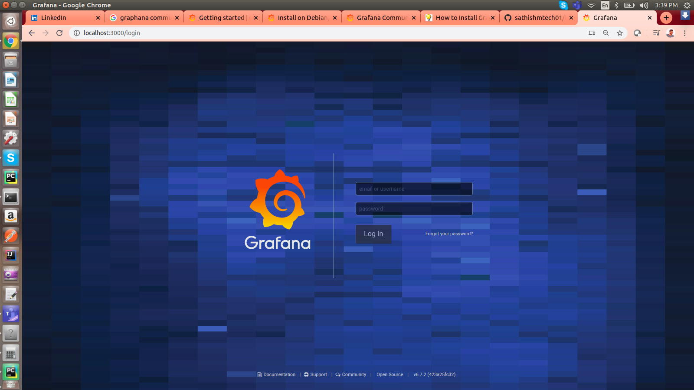
        
    username:admin
    password: admin
 
    
    Python Library:
    (elk) csk@csk-ai-revolution:~/PycharmProjects/git/logging_elk_stack$ pip install python-logstash
    (elk) csk@csk-ai-revolution:~/PycharmProjects/git/logging_elk_stack$ pip install django-elasticsearch-dsl
   

    

### Screen Shot

#### Kibana in terminal
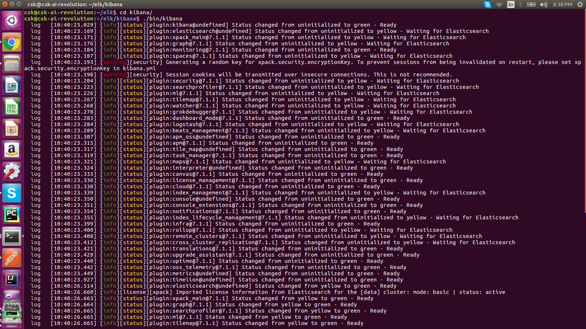
#### Elastic search in terminal
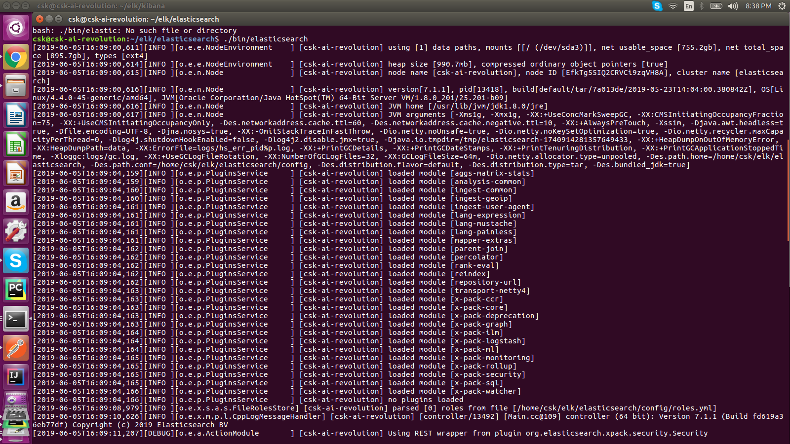
#### Logstash in terminal
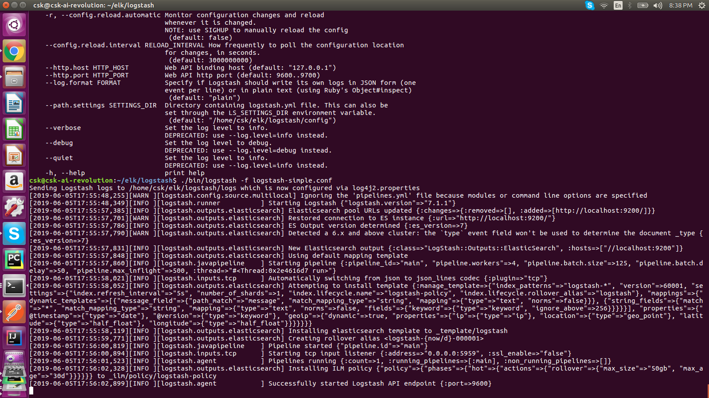

#### Kibana dashboard
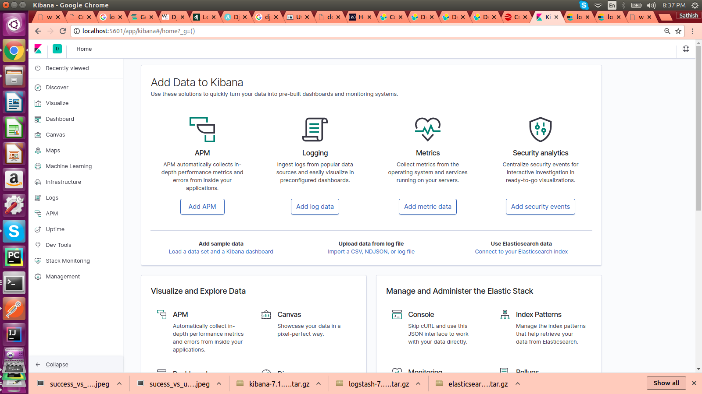
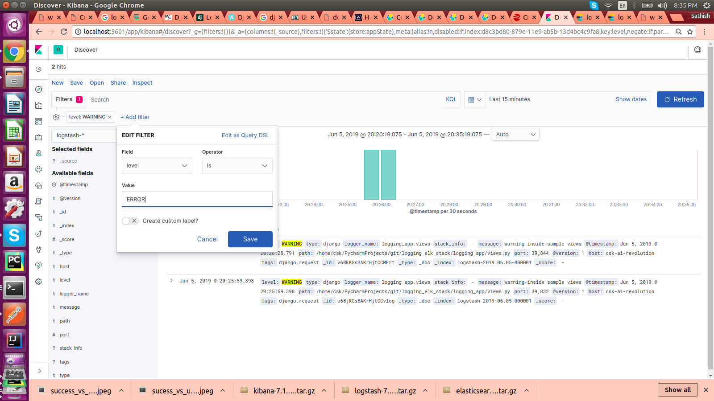

#### Kibana Vizualization
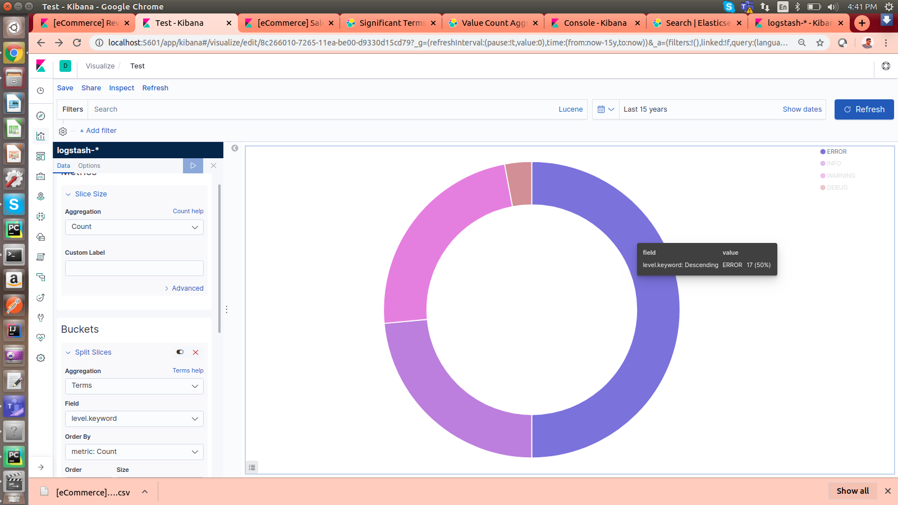

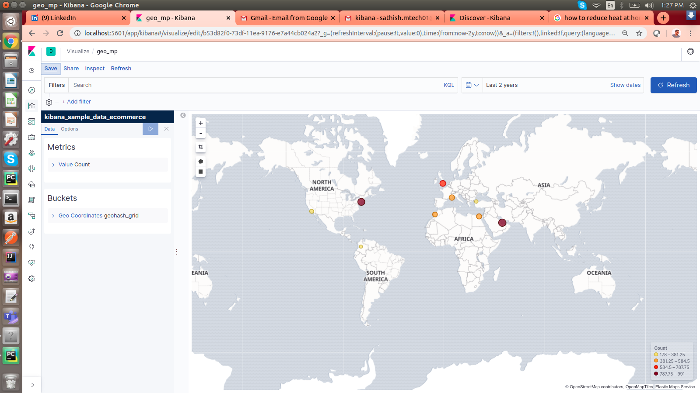

#### Grafana Vizualization
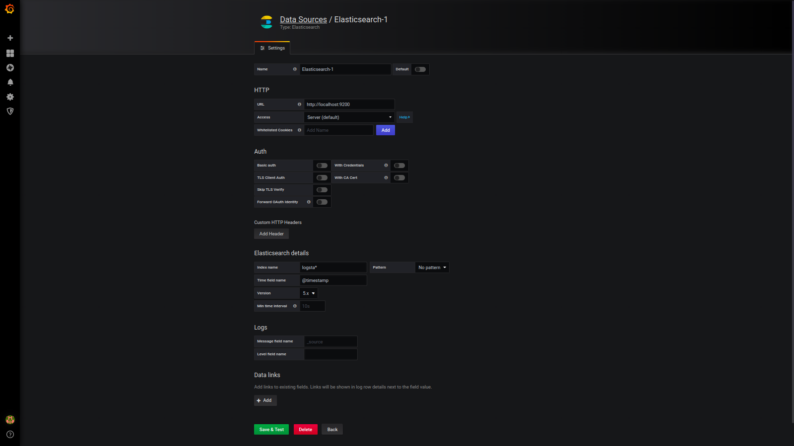

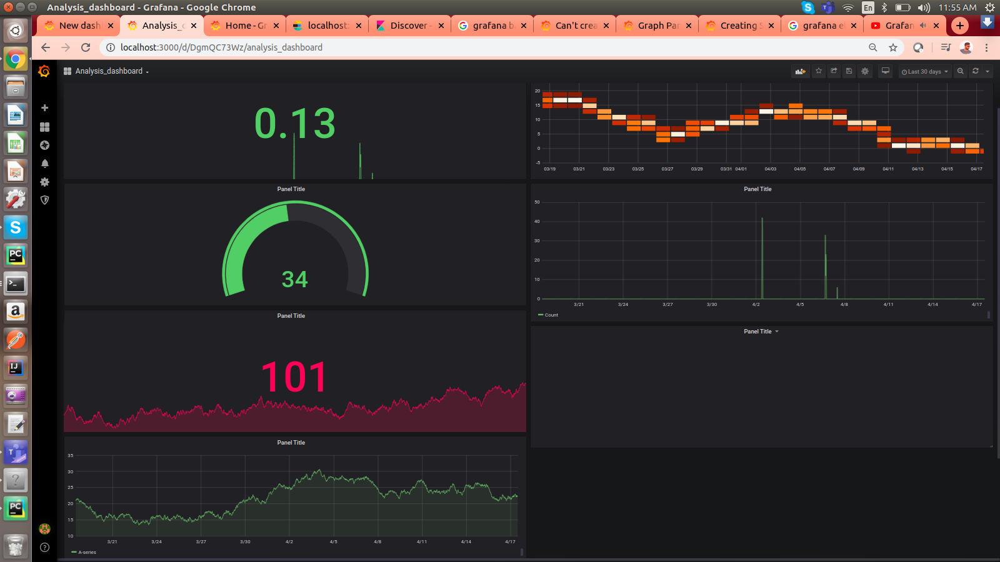

#### Elastic dashboard
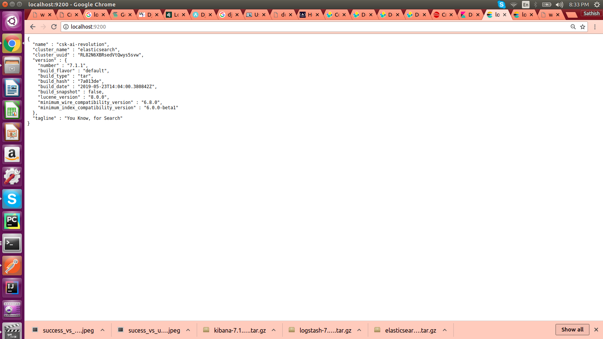

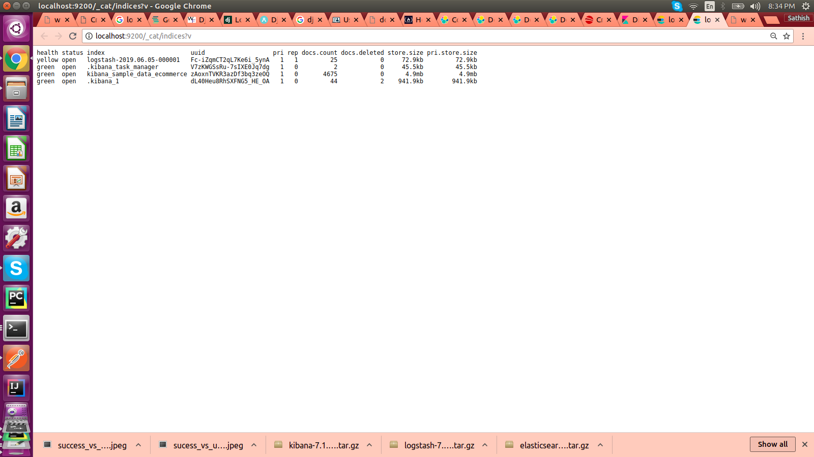

