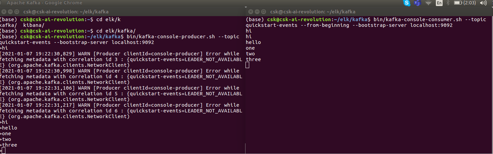

### Kafka
    
    
Azure Event Hub Example
    
    bin/kafka-console-consumer.sh --bootstrap-server xxx.servicebus.windows.net:9093 --consumer.config consumer.properties --topic tesy --from-beginning    

    bin/kafka-console-producer.sh --bootstrap-server xxx.servicebus.windows.net:9093 --producer.config consumer.properties --topic tesy

Locally run kafka server run

    Install kafka on local download apache kafka tar file
    unzip
    
    place the service file in /etc/system/system
        - zookeeper.service 
        - kafka.service
    
    Start the service
        - service zookeeper start
        - service kafka start 
    
#### Kafka Execution output (Producer - Consumer)
    
    Create topic
    bin/kafka-topics.sh --create --zookeeper  "localhost:2181" --replication-factor 1 --partitions 2 --topic test-partition
    
    
    Producer
    bin/kafka-console-producer.sh --topic test-partition --bootstrap-server localhost:9092
    
    Consumer
    bin/kafka-console-consumer.sh --topic test-partition --from-beginning --bootstrap-server localhost:9092
    

    
     

