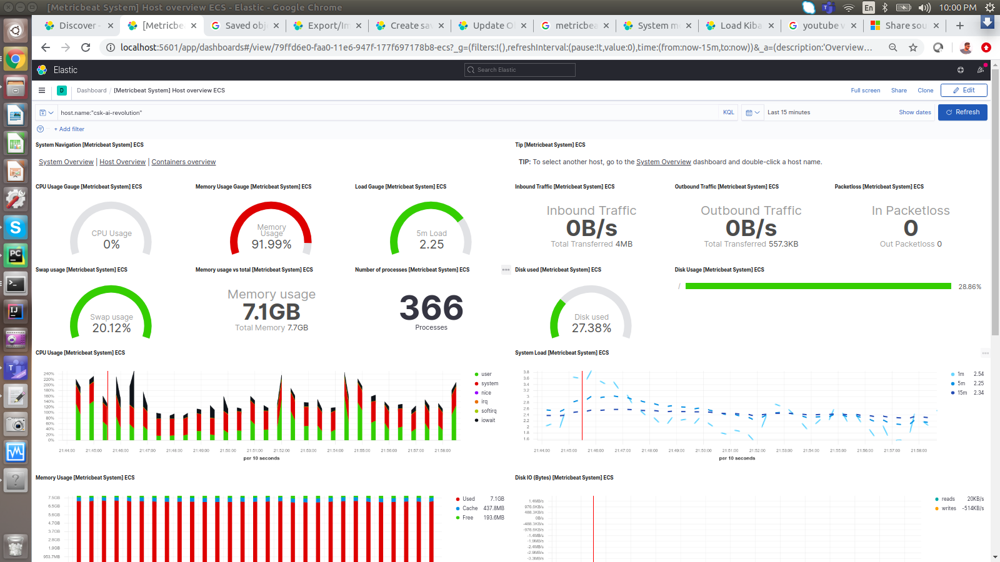

### Metric Beats

    Downloads
    
    curl -L -O https://artifacts.elastic.co/downloads/beats/metricbeat/metricbeat-7.10.1-linux-x86_64.tar.gz
    tar xzvf metricbeat-7.10.1-linux-x86_64.tar.gz
    

Execute Metric beat

    Run Locally
    
    (base) csk@csk-ai-revolution:~/elk/metricbeat$ chmod go-w /home/csk/elk/metricbeat/metric-linux-kafka.yaml
    (base) csk@csk-ai-revolution:~/elk/metricbeat$ ./metricbeat -e -c metric-linux-kafka.yaml 
            2021-01-07T19:58:25.043+0530	INFO	instance/beat.go:645	Home path: [/home/csk/elk/metricbeat] Config path: [/home/csk/elk/metricbeat] Data path: [/home/csk/elk/metricbeat/data] Logs path: [/home/csk/elk/metricbeat/logs]
            2021-01-07T19:58:25.137+0530	INFO	instance/beat.go:653	Beat ID: 8339cf7f-dd86-484b-a036-e3da0ae30135

    
    
    chmod go-w /home/csk/elk/metricbeat/metric-linux-kafka.yaml
    
    
    ./metricbeat setup -E setup.kibana.host=localhost:5601 -E setup.kibana.username=elastic -E setup.kibana.password=elastic
    
Load metricbeats dashboard kibana

    (base) csk@csk-ai-revolution:~/elk/metricbeat$ ./metricbeat setup -E setup.kibana.host=localhost:5601 -E setup.kibana.username=elastic -E setup.kibana.password=elastic
    Overwriting ILM policy is disabled. Set `setup.ilm.overwrite: true` for enabling.
    
    Index setup finished.
    Loading dashboards (Kibana must be running and reachable)
    Loaded dashboards
    
    
####Metric Beat Dashboard Kibana

